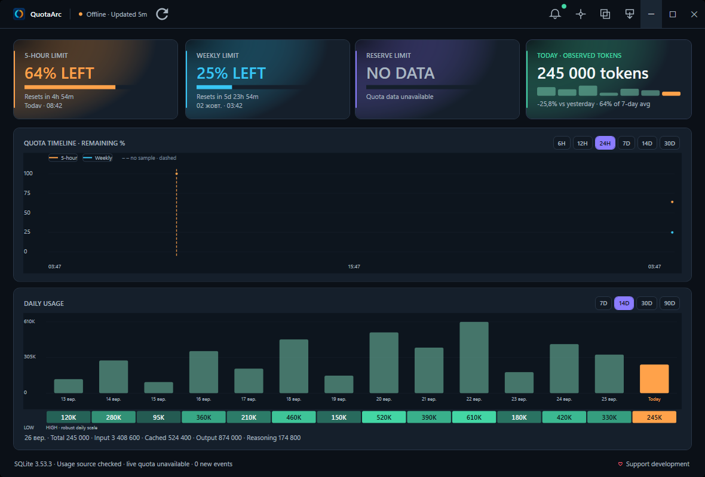

# QuotaArc 0.9.0 Public Beta

AI quota and usage at a glance for Codex on Windows.

QuotaArc 0.9.0 is an early public beta for Windows: a native desktop dashboard
for live Codex quota status and locally observed token usage. Its core
functionality is covered by automated tests, but the application is not yet
code-signed. It is free to use; optional support helps fund maintenance and
future updates.



*The screenshot uses synthetic local sample data. Live quota requires a connected Codex CLI.*

## Features

- Live 5-hour and weekly quota status, reset timing, and history.
- Reserve quota status when Codex exposes it.
- Local token-usage history with daily totals and input, cached, output, and
  reasoning breakdowns.
- A compact Mini panel, Windows tray controls, and configurable quota alerts.
- Local SQLite storage; usage history stays on this PC.

Quota values come from Codex quota data. Token counts are observed local usage,
not an account-wide billing total. QuotaArc does not infer quota from token
counts.

## Installation

Download `QuotaArc-0.9.0-win-x64.zip` from the [QuotaArc 0.9.0 GitHub
Release](https://github.com/u2loveme/QuotaArc/releases/tag/v0.9.0), verify it
against the published `SHA256SUMS.txt`, and extract the Windows x64 ZIP. Then run
`install-quotaarc.ps1` from the extracted folder. It installs the app under
`%LOCALAPPDATA%\Programs\QuotaArc` and creates a desktop shortcut. The package
is self-contained and includes its Windows App SDK dependencies.

To remove the managed application, run `uninstall-quotaarc.ps1` from the
package or installation folder. It removes the app and its shortcut while
keeping the local database and preferences under `%LOCALAPPDATA%\QuotaArc`.

The application can be installed without Codex. Live quota requires a
discoverable, authenticated Codex CLI that can start `codex app-server`.
Codex Desktop by itself is not guaranteed to provide that CLI connection.

This public beta is unsigned. Windows may show a SmartScreen or unknown
publisher warning. Verify the download checksum and use the official release
source above. Do not disable Windows security to install the app.

## Requirements

- Windows x64. The current project targets Windows SDK build 19041; a lower
  supported OS floor has not been established for this release.
- No separate .NET or Windows App SDK installation is required for the
  self-contained release package.
- For live quota: Codex CLI installed, signed in, and discoverable by
  QuotaArc. Network access is needed by Codex for live account data.
- Without a usable Codex CLI connection, the app opens but live quota appears
  unavailable. Existing local usage history can still be read when present.

## How it works

On first launch, QuotaArc creates and validates its SQLite database in
`%LOCALAPPDATA%\QuotaArc`. It starts the Codex CLI app-server over standard
input/output for live quota data. Separately, it scans the local Codex
`sessions` and `archived_sessions` folders and imports token-count fields into
the database; it does not retain the source JSONL records.

## Privacy

QuotaArc is local-first. It does not provide its own OpenAI sign-in or copy
Codex credentials. It uses the Codex CLI's existing authenticated context for
quota requests. The desktop app does not upload prompts, responses, tool
outputs, or session contents, and it contains no launch/download analytics
integration. Local history and settings remain on this PC.

The Vivi Bureau website is separate from the desktop app. Website download
analytics, when enabled, are governed by the website and do not mean the app
sends those events.

See [Privacy](docs/PRIVACY.md) and [Data sources](docs/DATA_SOURCES.md) for
details about locally stored data.

## Local data

The app creates its SQLite database automatically on first launch under
`%LOCALAPPDATA%\QuotaArc`. Uninstalling keeps the database and preferences so
reinstalling does not erase local history.

## Build from source

Build and test the WPF desktop application on Windows with the .NET 10 SDK:

```powershell
dotnet test tests/QuotaArc.Desktop.Tests/QuotaArc.Desktop.Tests.csproj -c Release
dotnet publish src/QuotaArc.Desktop/QuotaArc.Desktop.csproj -c Release -r win-x64 --self-contained true -p:WindowsAppSDKSelfContained=true
./scripts/package-quotaarc.ps1
```

The public beta source focuses on the current WPF application and its
installer. Retired prototypes, local measurement material, and internal
refactoring notes are not part of the public source snapshot.

## Support

QuotaArc is maintained by Vivi Bureau. Support is optional:

<https://vivibureau.pp.ua/quotaarc>

## License

License: **MPL-2.0** ([Mozilla Public License 2.0](LICENSE)). See
[third-party notices](THIRD_PARTY_NOTICES.md) and the `licenses/` directory
for dependency licenses and notices.
